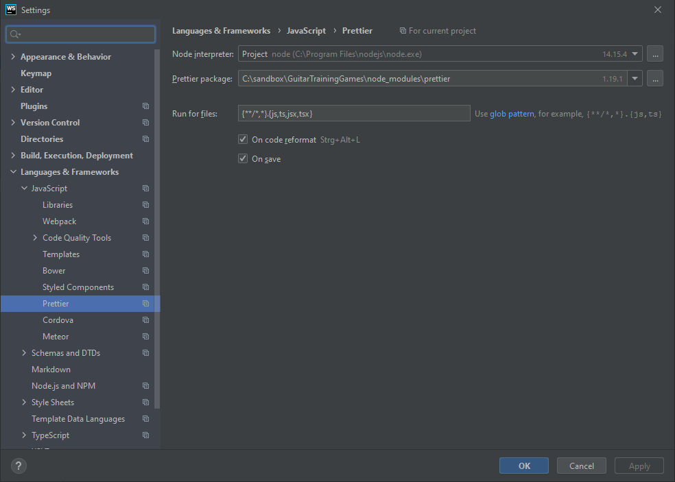
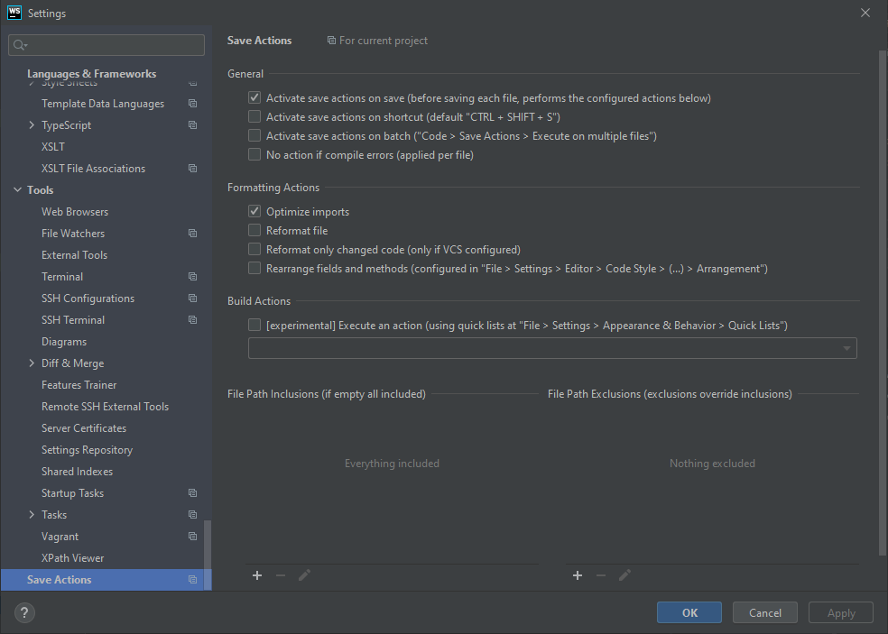

# GuitarTrainingGames 🎸

## Main user story

As a guitarist I want get a mode with a root key by only clicking one button so that I can exercise with it.

## Ideas for future features

-   All games:
    -   "How to play" is being presented in a dialog to save space on the game screens.
    -   It is possible to play in "automatic mode" which means that a new result is being rolled every X seconds (X is adjustable, e.g. with a slider).
-   Game: Notes
    -   The rolled guitar string is being visualized graphically in a colorful way (instead of text).
    -   The rolled note is being displayed in musical notation, e.g. colored on a circle of fifths (instead of text).
-   Game: Scales
    -   The desired scale can displayed on a fretboard (possibly in a dialog).
-   Game: Chords
    -   You can see suggestions on how to play the rolled chord on a fretboard visualization.
    -   It is possible to choose which chords should be possible to be rolled (e.g. a dialog with checkboxes/slide-toggles).
-   Sidenav shows a cool picture and/or logo.

# Technical notes

## Code formatting with Prettier

-   Follow this guide: https://prettier.io/docs/en/webstorm.html#using-prettier-in-webstorm.
-   Don't forget to install Prettier using `npm install --save-dev --save-exact prettier`.
-   In "advanced options", uncheck "Auto-save edited files to trigger the watcher".

Prettier File Watcher:

Prettier settings:

Save Actions Plugin:

## Deployment

Compare to: https://medium.com/tech-insights/how-to-deploy-angular-apps-to-github-pages-gh-pages-896c4e10f9b4

-   Install "github pages" tool (see package.json): `npm i angular-cli-ghpages --save-dev`
-   Build app: `ng build --prod --base-href "https://PeterGuntermann.github.io/GuitarTrainingGames/"`
-   Deploy to Github Pages: `npx angular-cli-ghpages --dir=dist/GuitarTrainingGames`

### Update 2021-03-08

-   Somehow, the above way doesn't work anymore. 🤷‍♂️
-   Anyways, you now only need to run `ng deploy` as a configuration has been added to the `angular.json` file.
